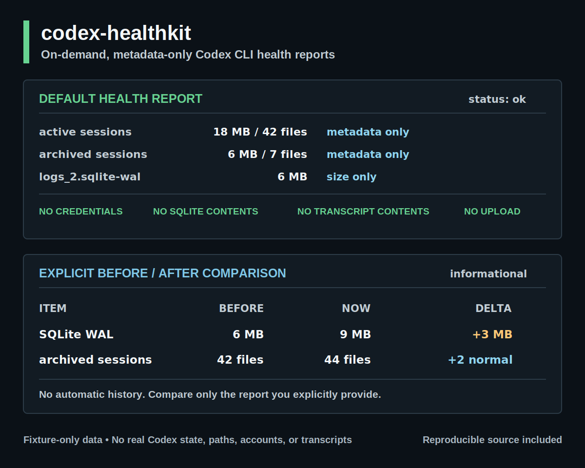

# codex-healthkit

[](https://github.com/Ishikawa-Hidekazu/codex-healthkit/actions/workflows/ci.yml)
[](LICENSE)
[](https://github.com/Ishikawa-Hidekazu/codex-healthkit/releases)

日常的にCodexを使う人のための、sessions、SQLite WAL、`codex doctor`、共有用redacted reportをメタデータ中心で確認するCodex CLI health checkです。

[English](README.md)

`codex-healthkit` は、Codexを日常的に使う人向けの、必要な時だけ実行するCLI health reportです。debug、issue作成、相談の前に、local sessionとSQLite WALのmetadataを確認できます。

デフォルトでは`codex`を実行せず、認証情報、token、cookie、SQLite本文、session transcript本文を読みません。daemon、dashboard、常駐監視、session recorderではなく、background serviceやWeb UIも不要です。OpenAI公式のプロジェクトではありません。

## 30秒で試す

default modeに必要なのはBashと標準的なUnix toolsだけです。`codex`は実行しません。

```bash
git clone --depth 1 https://github.com/Ishikawa-Hidekazu/codex-healthkit.git
cd codex-healthkit
./bin/codex-healthkit check
```

確認可能なMarkdown health reportをstdoutへ出します。daemonのinstall、Codex stateの変更、
reportのuploadは行いません。

## 何が出るか

<picture>
  <source media="(max-width: 600px)" srcset="assets/source/health-report-mobile.svg">
  
</picture>

[public-safeなtext sample](examples/report.redacted.md) ·
[再現可能なvisual source](assets/source/README.md)

## 一番狭いmodeを選ぶ

| mode | 用途 | 境界 |
| --- | --- | --- |
| health report | `./bin/codex-healthkit check` | local metadataだけ。`codex`を実行しない |
| before / after | `./bin/codex-healthkit check --compare before.json` | 明示したhealth reportを1件比較。自動historyなし |
| optional doctor | `./bin/codex-healthkit check --with-codex-doctor` | official `codex doctor --json`を明示実行。provider到達性checkの可能性あり |
| optional runtime | `./bin/codex-healthkit check --with-runtime` | macOS限定のmemory、swap、限定的process metadata。command argsは読まない |
| JSON output | health reportまたは比較へ`--json`を追加 | 同じdataを機械処理しやすい形式で出力 |

最初はdefault checkから始めてください。これが一番狭いモードで、`codex` を実行しません。

## 何のためのツールか

Codexを日常的に使っていると、次のような確認が必要になることがあります。

- ローカルのCodex関連ファイルが大きくなっていないか
- active / archived session が増えすぎていないか
- SQLite WALファイルが大きくなっていないか
- 誰かに相談するとき、何なら安全に共有できるか

`codex-healthkit` は、この範囲に絞った点検ツールです。利用量ダッシュボード、アカウント切り替え、クリーンアップ、transcript解析ツールではありません。

## ステータス

source-only alphaです。最新のtag付きreleaseは `v0.1.0-alpha.1` です。

最初のtag付きalphaは、意図的に狭く、読み取り専用にしています。
`main` branchにはtag公開後にreviewされた改善が含まれる場合があります。公開済みsource revisionを
固定してcloneする場合は`--branch v0.1.0-alpha.1 --depth 1`を指定します。

macOSとLinuxで検証済みです。WindowsはこのBash実装では未対応です。

## 誰のためのものか

`codex-healthkit` は、次のような人向けです。

- Codexを頻繁に使う
- ローカル状態を素早く確認したい
- 共有前に自分で確認できるレポートが欲しい
- credential、transcript、account dataを不用意に出したくない

issueを開く前、ローカル状態を時系列で見たいとき、他の開発者に相談する前の確認に向いています。

## よく使うコマンド

JSON health report:

```bash
./bin/codex-healthkit check --json
```

レポート保存:

```bash
./bin/codex-healthkit check > codex-health-report.md
./bin/codex-healthkit check --json > codex-health-report.json
```

明示的な前回レポートと比較:

```bash
./bin/codex-healthkit check --json > before.json
# Codex CLIを更新する、1日待つ、通常作業をする
./bin/codex-healthkit check --json --compare before.json
```

2つ目のコマンドで `--json` を外すと、Markdownの比較表として読めます。

## ローカルインストール

パッケージ配布前にローカルコマンドとして使いたい場合:

```bash
mkdir -p ~/.local/bin
ln -sf "$PWD/bin/codex-healthkit" ~/.local/bin/codex-healthkit
codex-healthkit check
```

保存したreportを消さず、local commandだけをuninstallする場合:

```bash
rm ~/.local/bin/codex-healthkit
```

cloneしたsource directoryが不要なら、別途削除します。

## 確認するもの

デフォルトの `codex-healthkit check` は、次を確認します。

- `codex` コマンドが存在するか。デフォルトでは実行しません
- active session directory のサイズと `.jsonl` 数
- archived session directory のサイズと `.jsonl` 数
- quarantine directory のサイズ
- `logs_2.sqlite`, `logs_2.sqlite-shm`, `logs_2.sqlite-wal` のファイルサイズ
- サイズだけを見た `ok` / `watch` の簡易サマリー

SQLiteデータベースやsession transcriptの中身は開きません。
また、デフォルトでは外部の `codex` コマンドも実行しません。

## オプション

```text
codex-healthkit check [--markdown|--json] [--compare <previous-report.json>] [--with-codex-version] [--with-codex-doctor] [--with-runtime]
codex-healthkit --version
codex-healthkit --help
```

### `--compare`

明示的に指定した過去の `codex-healthkit check --json` レポートを読み、現在のmetadata-only値と比較します。

通常のMarkdown出力では読みやすい差分表として、`--json` では機械処理しやすいdeltaとして出力します。

比較するもの:

- `logs_2.sqlite-wal` のサイズ
- `logs_2.sqlite` のサイズ
- active session directory のサイズと `.jsonl` 数
- archived session directory のサイズと `.jsonl` 数
- quarantine directory のサイズ

このモードには `jq` が必要です。historyを自動保存せず、telemetry送信もせず、SQLiteの中身やsession transcriptの中身は読みません。

両方のreportをmacOSで`--with-runtime`付きで作った場合、RendererのPID/start-time変化とComputer Use/Playwright worker件数deltaも比較します。これは確認候補であり、leakやorphanの確定診断ではありません。

### `--with-codex-version`

次を実行します。

```bash
codex --version
```

Codex CLIのバージョンをレポートに含めたい場合だけ使います。

### `--with-codex-doctor`

default checkでは`codex`を実行しません。公式Codex CLI doctorのsummaryも必要な場合だけ、
このoptionを明示的に指定します。

指定した場合だけ、次を実行します。

```bash
codex doctor --json
```

重要:

- このモードには `jq` が必要です
- Codex CLIが既存のCodex設定を通じてprovider到達性チェックを行う場合があります
- このモードは完全オフラインとは言えません
- `codex-healthkit` がreportするのは、redactedされた`status`、`ok`、`warn`、`fail`、noteだけです
- rawの `codex doctor` 出力はレポートに含めません
- session transcript本文とSQLite本文は読みません
- cleanup、delete、usage dashboard機能は追加しません

### `--with-runtime`

macOSで、次の限定的なruntime metadataを収集します。

- system memory free percentageとswap used
- Codex Renderer、Computer Use client/service、実行ファイル名から直接識別できるPlaywright MCP processの件数と合計RSS
- PID、PPID、RSS、uptime、推定start-time bucket、同じsnapshot内に親PIDが存在したか
- PPID 0/1候補と、親PIDがsnapshotにない候補を分離
- 6時間以上のlong-running候補
- orphan signalとlong uptimeの両方を満たす場合だけresidual候補

分類には実行ファイル名だけを使います。command arguments、environment variables、open files、実行ファイルpath、親command名は収集しません。genericな`node` processはargumentsを読まないとPlaywrightと判定できないため、意図的に除外します。

macOS以外では`unsupported`を返し、既存health checkは継続します。件数が多い、uptimeが長いというだけではleakと判定しません。Renderer churn候補は明示的な2つのruntime report間でstart/exitが合計4件以上、worker growth候補は件数が10以上増えた場合だけ出します。processのstop、kill、cleanupは行いません。

runtime objectのcontractは [schemas/runtime-diagnostics-v0.1.schema.json](schemas/runtime-diagnostics-v0.1.schema.json) にあります。

## 出力例

[examples/report.redacted.md](examples/report.redacted.md) を参照してください。

短い例:

```text
# codex-healthkit report

- summary: ok
- codex command found: yes
- codex version: not requested
- sessions: 42 files, 18M
- archived sessions: 7 files, 2.1M
- SQLite WAL: 0B
- auth files read: no
- session transcript contents read: no
```

## 結果の読み方

レポートのsummaryは、意図的にシンプルにしています。

- `ok`: サイズだけの確認では、大きなSQLite/WALの増加は見つかっていません
- `watch`: local fileまたは明示実行したruntime metadataが、文書化された確認thresholdを超えた状態です
- `fail`: optional official doctor modeを実行し、公式 `codex doctor` がfailureを返した状態です

`watch` は、認証情報が漏れた、SQLite本文を読んだ、process leakが確定したという意味ではありません。runtime findingsは保守的な確認候補で、通常の並列作業でもfalse positiveになり得ます。

詳しくは [docs/usage.md](docs/usage.md) と [docs/faq.md](docs/faq.md) を参照してください。

## 安全境界

`codex-healthkit` は次を読みません。

- `~/.codex/auth.json`
- token files
- cookies
- localStorage
- OS credential stores
- SQLite contents
- session transcript contents
- process command arguments、environment variables、open files
- account IDs or email addresses

`codex-healthkit` はsessions配下の `.jsonl` ファイル数を数えますが、rawのファイル名はレポートしません。

レポートは確認後にissueへ貼りやすい形を目指していますが、共有前にはユーザー自身で必ず確認してください。

詳しくは [docs/safety-boundary.md](docs/safety-boundary.md) を参照してください。

## ドキュメント

- [Usage guide](docs/usage.md)
- [FAQ](docs/faq.md)
- [Safety boundary](docs/safety-boundary.md)
- [Release checklist](docs/release-checklist.md)
- [English README](README.md)

## やらないこと

`codex-healthkit` は次を行いません。

- Codexアカウント切り替え
- auth fileの解析
- transcriptからの利用量やquota推定
- sessionの削除、archive、cleanup
- browser profileの読み取り
- レポートのアップロード
- background telemetry

## 必要なもの

デフォルトモード:

- macOSまたはLinux。WindowsはこのBash実装では未対応です
- Bash
- 標準的なUnix tools: `find`, `du`, `stat`, `awk`, `wc`, `tr`

比較mode:

- `jq`

optional doctor mode:

- Codex CLI
- `jq`

optional runtime mode:

- macOSのみ
- macOS標準tools: `memory_pressure`, `sysctl`, `ps`

## 開発

チェック実行:

```bash
bash -n bin/codex-healthkit scripts/render-visuals.sh tests/run.sh tests/fixtures/fake-bin/codex
shellcheck bin/codex-healthkit scripts/render-visuals.sh tests/run.sh tests/fixtures/fake-bin/codex
tests/run.sh
```

## 困ったとき

何かおかしいと感じた場合:

1. まずdefault checkを実行してください。
2. レポートを自分で確認し、必要な箇所をredactしてください。
3. 近いissue templateからissueを作成してください。

最初のtroubleshooting:

```bash
./bin/codex-healthkit --help
bash --version
command -v find du stat awk wc tr
```

`--compare`または`--with-codex-doctor`が使えない場合は`command -v jq`も確認します。
doctor modeにはofficial `codex` CLIも必要です。

public issueには、credentials、tokens、cookies、private paths、raw session transcripts、raw `codex doctor` outputを貼らないでください。

[SUPPORT.md](SUPPORT.md) を参照してください。

## 安全にissueを開くには

issueを開くときは:

- 近いissue templateを使ってください
- 実行したcommandを書いてください
- OSを書いてください
- 自分で確認し、redactした出力だけを貼ってください
- 期待した結果と実際の結果を書いてください

確認していないraw reportは貼らないでください。

## コントリビュート

小さく焦点の合った貢献を歓迎します。特に次のようなものは助かります。

- documentation improvements
- safer examples
- fixture-based tests
- Linux compatibility checks
- shell portability fixes

pull requestを開く前に [CONTRIBUTING.md](CONTRIBUTING.md) と [CODE_OF_CONDUCT.md](CODE_OF_CONDUCT.md) を確認してください。

## セキュリティ

public issueには、credentials、tokens、cookies、private paths、raw session transcripts、raw `codex doctor` outputを含めないでください。

[SECURITY.md](SECURITY.md) を参照してください。

## Changelog

[CHANGELOG.md](CHANGELOG.md) を参照してください。

## ロードマップ

近い範囲:

- source-only alphaの日次利用を継続
- fixture-based testsの追加
- report exampleの改善
- 実用改善がまとまった段階で次alphaを判断

新しい安全レビューが必要な範囲:

- account switching
- transcript parsing
- usage estimation
- automatic cleanup
- background monitoring
- npm package distribution

## ライセンス

MITです。[LICENSE](LICENSE) を参照してください。
