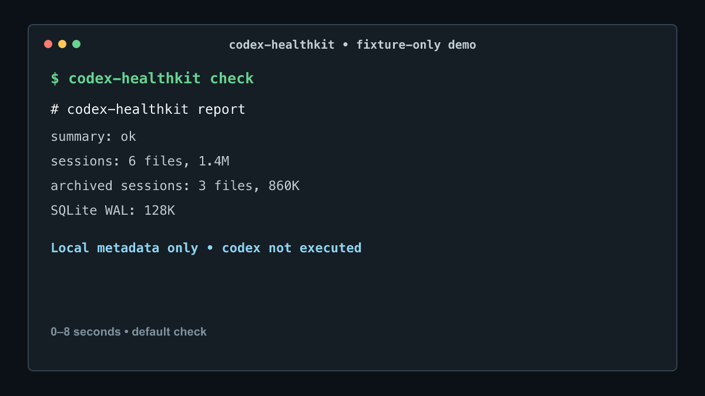

# codex-healthkit

[](https://github.com/Ishikawa-Hidekazu/codex-healthkit/actions/workflows/ci.yml)
[](LICENSE)
[](https://github.com/Ishikawa-Hidekazu/codex-healthkit/releases)

Codex can keep working while local sessions and SQLite WAL quietly grow; `codex-healthkit` shows that growth without opening credentials, databases, or transcript contents.

[日本語版](README.ja.md)

`codex-healthkit` is an on-demand CLI health report for daily Codex users. It checks local session and SQLite WAL metadata before debugging, opening an issue, or asking for help.

By default, it does **not** execute `codex` or read credentials, token files, cookies, SQLite contents, or session transcript contents. It is not a daemon, dashboard, live monitor, or session recorder, and it does not require a background service or web UI. Not affiliated with OpenAI.

## 30-Second Quick Start

Default mode needs only Bash and standard Unix tools. It does not execute
`codex`.

```bash
git clone --depth 1 https://github.com/Ishikawa-Hidekazu/codex-healthkit.git
cd codex-healthkit
./bin/codex-healthkit check
```

The command prints a reviewable Markdown health report to stdout. It does not
install a daemon, modify Codex state, or upload the report.

## 24-Second Terminal Demo



The demo uses synthetic fixture values. It does not contain a real Codex home,
account, path, report, database, or transcript.

## What You Get

<picture>
  <source media="(max-width: 600px)" srcset="assets/source/health-report-mobile.svg">
  
</picture>

[View the public-safe text sample](examples/report.redacted.md) ·
[View the reproducible visual sources](assets/source/README.md)

## Choose The Narrowest Mode

| Mode | Use it for | Boundary |
| --- | --- | --- |
| Health report | `./bin/codex-healthkit check` | Local metadata only; does not execute `codex` |
| Before / after | `./bin/codex-healthkit check --compare before.json` | Compares one explicit health report; no automatic history |
| Optional doctor | `./bin/codex-healthkit check --with-codex-doctor` | Explicitly runs official `codex doctor --json`; may perform provider reachability checks |
| Optional runtime | `./bin/codex-healthkit check --with-runtime` | macOS-only memory, swap, and bounded process metadata; no command arguments |
| JSON output | Add `--json` to a health report or comparison | Same data in a machine-readable format |

Start with the default check. It is the narrowest mode and does not execute `codex`.

## Why This Exists

Heavy Codex users often need to answer simple operational questions:

- Is my local Codex state unusually large?
- Are active or archived session directories growing?
- Is the SQLite WAL file large enough to deserve attention?
- What can I safely share when asking someone else to help debug my setup?

`codex-healthkit` focuses on that narrow problem. It is not a usage dashboard, account switcher, cleanup tool, or transcript parser.

## Status

Source-only alpha. Latest tagged release: `v0.1.0-alpha.1`.

The first tagged alpha is intentionally narrow and read-only.
The `main` branch may contain reviewed improvements added after that tag. For
the published source revision, clone with `--branch v0.1.0-alpha.1 --depth 1`.

Tested on macOS and Linux. Windows is not supported by this Bash implementation.

## Who It Is For

`codex-healthkit` is for people who:

- use Codex frequently
- want a quick local operational check
- need a report they can review before sharing
- care about avoiding credential, transcript, or account-data exposure

It is especially useful before opening an issue, comparing local state over time, or asking another developer to help debug a local setup.

## Three Real-World Uses

1. **Before and after a Codex CLI update:** save one JSON report, update normally, then compare WAL and session metadata without automatic history.
2. **Daily operational review:** notice whether active sessions, archived sessions, quarantine, or SQLite files are growing before deciding whether deeper investigation is needed.
3. **Preparing a support request:** generate a small report, review it yourself, and share only the redacted metadata that is relevant to the issue.

## Common Commands

JSON health report:

```bash
./bin/codex-healthkit check --json
```

Save a report:

```bash
./bin/codex-healthkit check > codex-health-report.md
./bin/codex-healthkit check --json > codex-health-report.json
```

Compare with an explicit previous report:

```bash
./bin/codex-healthkit check --json > before.json
# update Codex CLI, wait a day, or run normal work
./bin/codex-healthkit check --json --compare before.json
```

Omit `--json` on the second command when you want a Markdown comparison table.

## Optional Local Install

If you want `codex-healthkit` on your local `PATH` before package distribution exists:

```bash
mkdir -p ~/.local/bin
ln -sf "$PWD/bin/codex-healthkit" ~/.local/bin/codex-healthkit
codex-healthkit check
```

Uninstall the local command without deleting reports you chose to save:

```bash
rm ~/.local/bin/codex-healthkit
```

Delete the cloned source directory separately when you no longer need it.

## What It Checks

By default, `codex-healthkit check` reports:

- whether the `codex` command is available, without executing it
- active session directory size and `.jsonl` count
- archived session directory size and `.jsonl` count
- quarantine directory size
- `logs_2.sqlite`, `logs_2.sqlite-shm`, and `logs_2.sqlite-wal` file sizes
- a small `ok` / `watch` summary based on size-only checks

It does not open SQLite databases or session transcripts.
It also does not execute the external `codex` command by default.

## Options

```text
codex-healthkit check [--markdown|--json] [--compare <previous-report.json>] [--with-codex-version] [--with-codex-doctor] [--with-runtime]
codex-healthkit --version
codex-healthkit --help
```

### `--compare`

Reads an explicit previous `codex-healthkit check --json` report and compares metadata-only values with the current check.

Use it with the default Markdown output for a readable delta table, or with `--json` for machine-readable deltas.

It compares:

- `logs_2.sqlite-wal` size
- `logs_2.sqlite` size
- active session directory size and `.jsonl` count
- archived session directory size and `.jsonl` count
- quarantine directory size

This mode requires `jq`. It does not store history, upload telemetry, read SQLite contents, or read session transcript contents.

When both reports were created with `--with-runtime` on macOS, comparison also reports Renderer PID/start-time changes and Computer Use/Playwright worker count deltas. These are review candidates, not proof of a leak or orphan process.

### `--with-codex-version`

Runs:

```bash
codex --version
```

Use this only when you want the report to include the installed Codex CLI version.

### `--with-codex-doctor`

The default check does not execute `codex`. Use this option only when you also
want a summary from the official Codex CLI doctor command.

When explicitly requested, it runs:

```bash
codex doctor --json
```

Important:

- this mode requires `jq`
- Codex CLI may perform provider reachability checks through your existing Codex configuration
- this mode is not fully offline
- `codex-healthkit` reports only redacted summary fields: `status`, `ok`, `warn`, `fail`, and a note
- raw `codex doctor` output is not included in the report
- session transcript contents and SQLite contents are not read
- this option does not add cleanup, delete, or usage-dashboard behavior

### `--with-runtime`

Collects bounded runtime metadata on macOS only:

- system memory-free percentage and swap used
- count and total RSS for Codex Renderer, Computer Use client/service, and directly identifiable Playwright MCP processes
- PID, PPID, RSS, uptime, estimated start-time bucket, and whether the parent PID was present in the same snapshot
- separate PPID 0/1 and parent-PID-absent candidates
- long-running candidates at six hours or more
- residual candidates only when an orphan signal and long uptime occur together

It uses executable names only for category matching. It does not collect command arguments, environment variables, open files, executable paths, or parent command names. A generic `node` process cannot be identified as Playwright without reading arguments, so it is intentionally excluded.

On non-macOS systems this section reports `unsupported` and the existing health check continues. High count or long uptime alone is not a leak. A Renderer churn candidate is emitted only when two explicit runtime reports show at least four combined start/exit events; worker growth requires a count increase of at least 10. No process is stopped, killed, or cleaned up.

The runtime object contract is documented in [schemas/runtime-diagnostics-v0.1.schema.json](schemas/runtime-diagnostics-v0.1.schema.json).

## Example Output

See [examples/report.redacted.md](examples/report.redacted.md).

Short example:

```text
# codex-healthkit report

- summary: ok
- codex command found: yes
- codex version: not requested
- sessions: 42 files, 18M
- archived sessions: 7 files, 2.1M
- SQLite WAL: 0B
- auth files read: no
- session transcript contents read: no
```

## How To Read The Result

The report summary is intentionally simple:

- `ok`: no large local SQLite/WAL spike was detected by the size-only check
- `watch`: one of the local file or explicitly requested runtime metadata values crossed a documented review threshold
- `fail`: optional official doctor mode was requested and official `codex doctor` reported failures

`watch` does not mean credentials were exposed, SQLite contents were read, or a process leak was proven. Runtime process findings are conservative review candidates and can be false positives during normal parallel work.

For more examples, see [docs/usage.md](docs/usage.md) and [docs/faq.md](docs/faq.md).

## Safety Boundary

`codex-healthkit` never reads:

- `~/.codex/auth.json`
- token files
- cookies
- localStorage
- OS credential stores
- SQLite contents
- session transcript contents
- process command arguments, environment variables, or open files
- account IDs or email addresses

`codex-healthkit` counts `.jsonl` files under the sessions directories, but raw file names are not reported.

Reports are intended to be safe to paste into an issue after review, but users should still check them before sharing.

See [docs/safety-boundary.md](docs/safety-boundary.md).

## Documentation

- [Usage guide](docs/usage.md)
- [FAQ](docs/faq.md)
- [Safety boundary](docs/safety-boundary.md)
- [Release checklist](docs/release-checklist.md)
- [Japanese README](README.ja.md)

## Non-Goals

`codex-healthkit` does not:

- switch Codex accounts
- parse auth files
- estimate usage or quota from transcripts
- delete, archive, or clean up sessions
- read browser profiles
- upload reports
- run background telemetry

## Known Limitations

- It does not explain the cause of growth or repair Codex state.
- It does not delete, archive, compact, or clean up files.
- It does not estimate account usage, quota, or rate limits.
- It does not keep automatic history; comparisons require an explicit previous JSON report.
- Default checks are size/count observations, not SQLite integrity checks.
- Windows is not supported by this Bash implementation.
- Optional official doctor behavior can change with the installed Codex CLI.

## Requirements

Default mode:

- macOS or Linux; Windows is not supported by this Bash implementation
- Bash
- standard Unix tools: `find`, `du`, `stat`, `awk`, `wc`, `tr`

Comparison mode:

- `jq`

Optional doctor mode:

- Codex CLI
- `jq`

Optional runtime mode:

- macOS only
- standard macOS tools: `memory_pressure`, `sysctl`, `ps`

## Development

Run checks:

```bash
bash -n bin/codex-healthkit scripts/render-visuals.sh tests/run.sh tests/fixtures/fake-bin/codex
shellcheck bin/codex-healthkit scripts/render-visuals.sh tests/run.sh tests/fixtures/fake-bin/codex
tests/run.sh
```

## Getting Help

If something looks wrong:

1. Run the default check first.
2. Review and redact the report.
3. Open an issue using the closest issue template.

Quick troubleshooting:

```bash
./bin/codex-healthkit --help
bash --version
command -v find du stat awk wc tr
```

If `--compare` or `--with-codex-doctor` is unavailable, also check
`command -v jq`. Doctor mode additionally requires the official `codex` CLI.

Please do not paste credentials, tokens, cookies, private paths, raw session transcripts, or raw `codex doctor` output into public issues.

See [SUPPORT.md](SUPPORT.md).

## Opening Issues Safely

When opening an issue:

- use the closest issue template
- include the command you ran
- include your OS
- include reviewed and redacted output only
- explain what you expected and what happened instead

Do not include raw reports that you have not reviewed.

## Contributing

Small, focused contributions are welcome, especially:

- documentation improvements
- safer examples
- fixture-based tests
- Linux compatibility checks
- shell portability fixes

Please read [CONTRIBUTING.md](CONTRIBUTING.md) and [CODE_OF_CONDUCT.md](CODE_OF_CONDUCT.md) before opening a pull request.

## Security

Please do not include credentials, tokens, cookies, private paths, raw session transcripts, or raw `codex doctor` output in public issues.

See [SECURITY.md](SECURITY.md).

## Changelog

See [CHANGELOG.md](CHANGELOG.md).

## Roadmap

Near-term:

- continue daily use of the source-only alpha
- more fixture-based tests
- clearer report examples
- decide the next alpha only after practical improvements accumulate

Out of scope until a new safety review:

- account switching
- transcript parsing
- usage estimation
- automatic cleanup
- background monitoring
- npm package distribution

## License

MIT. See [LICENSE](LICENSE).
